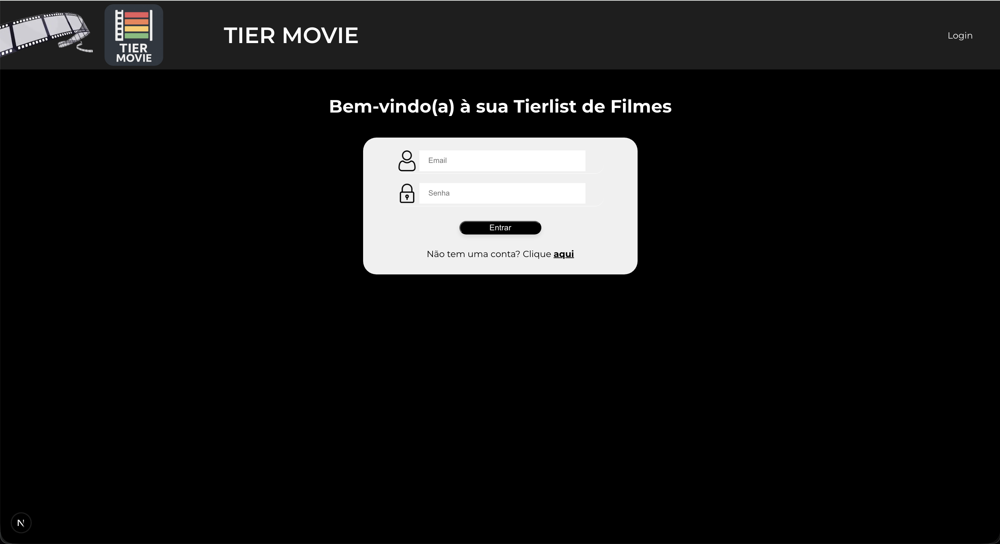
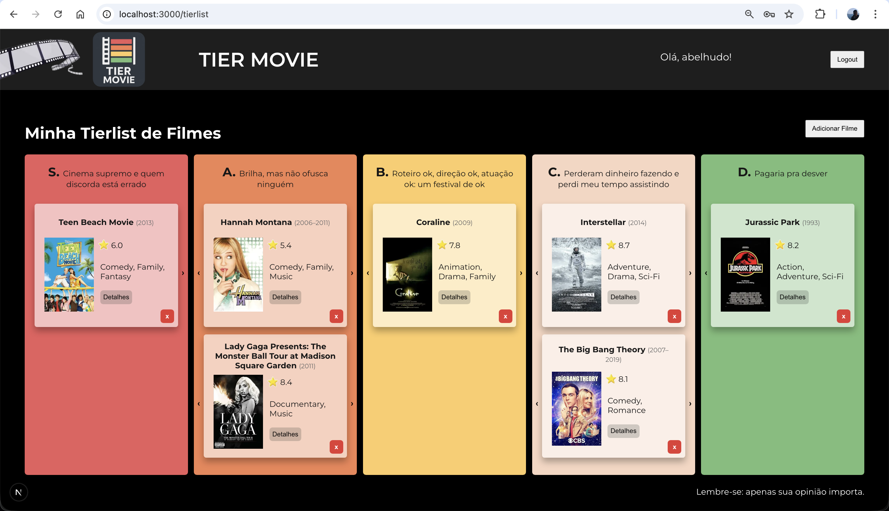

# 🎬 Tier Movie

Esse projeto é um projeto **web de Tierlist de filmes**, criada para classificar filmes de acordo com sua opinião (e somente ela).  
A ideia é permitir que qualquer pessoa consiga montar suas próprias tierlists de maneira intuitiva, usando dados reais de filmes obtidos pela OMDb API.

### Login


### Tierlist

---

## 🚀 Funcionalidades

- 🔍 Busca de filmes por nome
- 🎞️ Busca de dados via [**OMDb API**](https://www.omdbapi.com)
- 🧩 Classificação em tiers S, A, B, C, D
- 💾 Persistência básica de dados (local)

___
[Next.js](https://nextjs.org) project criado com [`create-next-app`](https://nextjs.org/docs/app/api-reference/cli/create-next-app).


Para rodar:

```bash
npm run dev
```

Abra [http://localhost:3000](http://localhost:3000) no seu navegador e cadastre um usuário.
Faça Log-in e aproveite a aplicação.


## Mais informações sobre o Next.js


- [Next.js Documentation](https://nextjs.org/docs) - learn about Next.js features and API.
- [Learn Next.js](https://nextjs.org/learn) - an interactive Next.js tutorial.

You can check out [the Next.js GitHub repository](https://github.com/vercel/next.js) - your feedback and contributions are welcome!

## Deploy on Vercel

The easiest way to deploy your Next.js app is to use the [Vercel Platform](https://vercel.com/new?utm_medium=default-template&filter=next.js&utm_source=create-next-app&utm_campaign=create-next-app-readme) from the creators of Next.js.

Check out our [Next.js deployment documentation](https://nextjs.org/docs/app/building-your-application/deploying) for more details.
